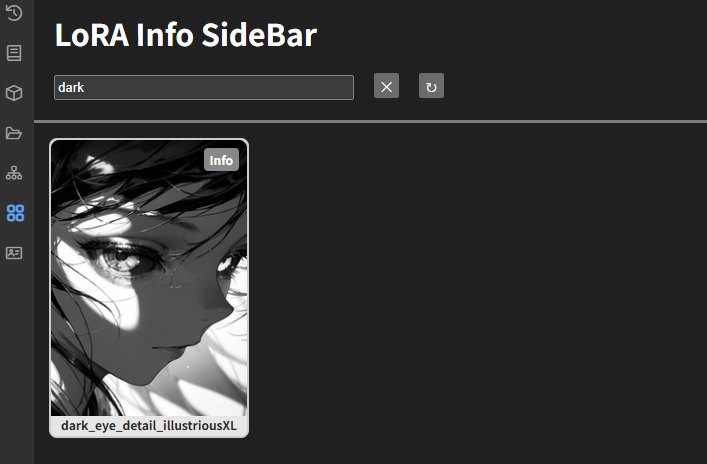
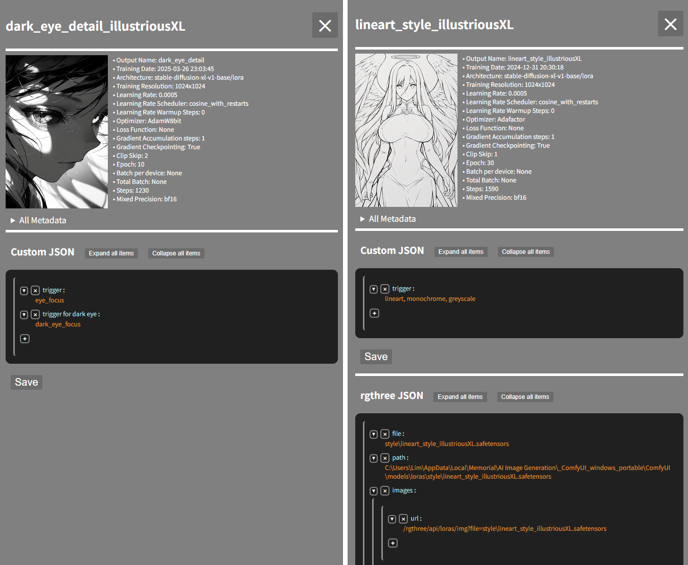

# comfyui-lorainfo-sidebar

## Description 
**LoRA Info Sidebar** allows you to preview images of LoRA files and edit their associated JSON files

## Installation
1. Goto `ComfyUI/custom_nodes` in terminal 
2. `git clone https://github.com/somesomebody/comfyui-lorainfo-sidebar.git`
3. Restart the ComfyUI

**OR**

If ComfyUI Manager already installed
1. search `comfyui-lorainfo-sidebar` and install 
2. Restart the ComfyUI

## Usage
- This extension scans the `models/loras` folder for `.safetensors` files.
- The JSON and preview image filenames must match the LoRA file's name.
- You can add a preview image and a JSON file in the same directory as the LoRA file.
- You can edit the JSON file like this:

## Change Log
- 1.2.0
  - Modified the JSON editor to support nested JSON structures
  - Reduced the server load caused by loading previews
  - Add a white overlay while loading the sidebar
  - Fix the CSS loading issue
- 1.1.6
  - Adjustments to the LoRA file preview styling
  - Improved the loading stability of the info button and filename text in the LoRA file preview across different environments
  - Pinned the title and search bar to the top

## Planned Features
- Support rgthree's JSON file
- Enhance visibility of all metadata