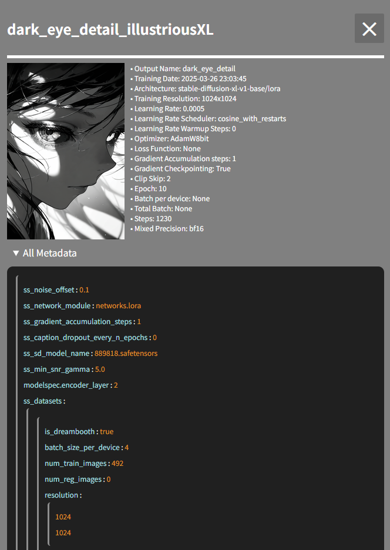

# lorainfo-sidebar


## Description 
**LoRA Info Sidebar** allows you to preview images of LoRA files and edit their associated JSON files

<br>

## Installation
1. Open a terminal and navigate to `ComfyUI/custom_nodes` in terminal 
2. Run 
   ```bash 
    git clone https://github.com/somesomebody/lorainfo-sidebar.git
3. Restart the ComfyUI

**OR**

If ComfyUI Manager is already installed
1. search `comfyui-lorainfo-sidebar` and install 
2. Restart the ComfyUI

<br>

## Usage
- This extension scans the `models/loras` folder for `.safetensors` files.
- The JSON and preview image filenames must match the LoRA file's name.
- You can place the preview image and JSON file in the same directory as the LoRA file.
- If rgthree's JSON file exists, you can edit it

<br>

- You can check LoRA's metadata like this :


<br>

- You can edit the JSON file like this :


<br>

## Change Log
- 1.2.2
  - Fix the JPG preview loading issue
  - Add settings to allow changing the font size of metadata and JSON
  - Select all text when you focus on a key or value
  - Add placeholders for the key and value fields
  - Files that start with . or ._ are now ignored
- 1.2.1
  - Support for rgthree's JSON file
  - Add a toggle button to show/hide items
  - Enhance the visibility of all metadata
- 1.2.0
  - Modified the JSON editor to support nested JSON structures
  - Reduced the server load caused by loading previews
  - Add a white overlay while loading the sidebar
  - Fix the CSS loading issue
- 1.1.6
  - Adjustments to the LoRA file preview styling
  - Improved the loading stability of the info button and filename text in the LoRA file preview across different environments
  - Pinned the title and search bar to the top

<br>

## Planned Features